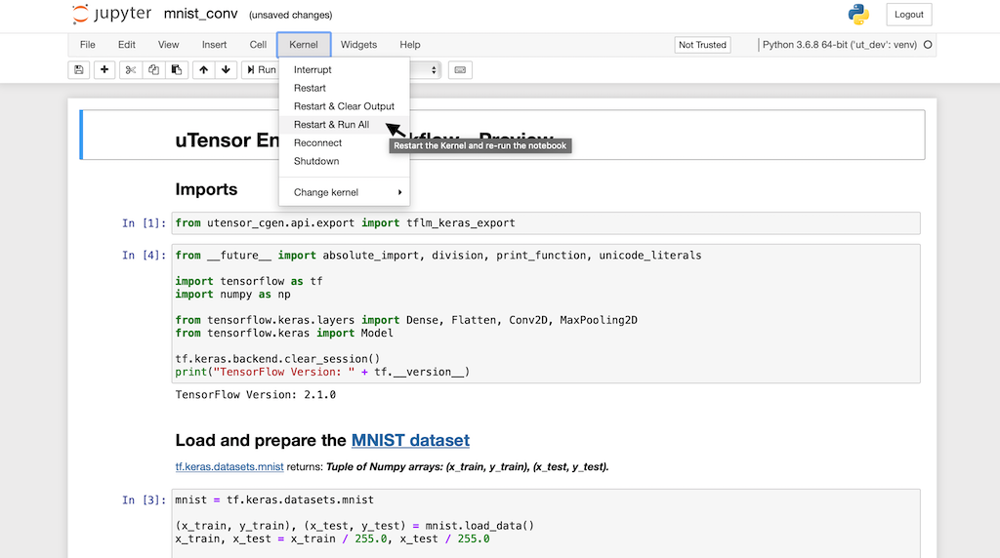

# uTensor Hello World Repository
This is an end-to-end, training-to-deployment, uTensor jump-start guide.

This example trains a convolutional neural network on MNIST in Jupyter-notebook using Keras, converts the trained model to C++ via uTensor, and deploy it to a Mbed board. A header file containing data of hand-written digit of `7` used as the test data on-device.

Although, the [K64F](https://os.mbed.com/platforms/FRDM-K64F/) is used in this tutorial, any Mbed enabled board should work.

> **Note**  
> For a more comprehensive guide, please refer to this **[getting-started tutorial](docs/getting-started.md)**. It covers the environment set up and has code walk-throughs.


## What's New with uTensor
- TF2 Support
- One-line Exporter API
- Improved Inference API
- Clear, Concise, and Debuggable Generated Code
- Deterministic Memory Usage
- Lower Static and Dynamic Memory Footprint
- TensorFlow Lite Micro Interoperability (shared kernels)
- Offline Quantization
- *Offline Memory Optimization **(WIP)***
- *PyTorch Importer **(WIP)***
- *Arduino Support **(WIP)***

## Clone the Sample Project
```bash
$ git clone https://github.com/uTensor/utensor-helloworld.git
# or, SSH: git@github.com:uTensor/utensor-helloworld.git
```

## Requirements
- [mbed-cli](https://os.mbed.com/docs/mbed-os/v6.0/build-tools/install-and-set-up.html)
- [utensor-cgen](https://github.com/uTensor/utensor_cgen)
- [Jupyter-Notebook](https://jupyter.org)

## Installation
The required software can be installed with either manual installation or [`pipenv`](https://github.com/pypa/pipenv).

### Manual Installation

#### Install the `Mbed-CLI`
The Arm cross-compiler is a dependency. On MacOS, it can be installed with Brew:
```bash
$ brew install arm-none-eabi-gcc
```
Mbed-CLI is installed with:
```bash
$ pip install mbed-cli
```

For installations on other platforms, please visit [Mbed-CLI's installation page](https://os.mbed.com/docs/mbed-os/v6.0/quick-start/build-with-mbed-cli.html).

#### `uTensor-cli` Installation
The latest stable uTensor-SDK can be installed with `pip`. It also include a nice command-line interface.
```bash
$ pip install utensor-cgen jupyterlab
# link the current Python runtime with Jupyter, calling it `ut`
$ pip install ipykernel
$ ipython kernel install --user --name=ut
```

### Installation with `pipenv` (Alternative)

Alternately, if you prefer [`pipenv`](https://github.com/pypa/pipenv), you can install everything above with:

```bash
$ brew install arm-none-eabi-gcc #required by mbed-cli
$ cd utensor-helloworld
$ pipenv install
$ pipenv shell # to activate the environment
```


## Training and Code Generation
The sample project should already include the generated model code and is ready to be compiled, however if you want to generate the input model directly check out [mnist_conv.ipynb](https://github.com/uTensor/utensor-helloworld/blob/re-arch-rc1/mnist_conv.ipynb) which contains the instructions for training this convolutional neural network. It can be easily modified to suit your need.

You will need Jupyter-notebook and utensor-cli to be installed under the same Python virtual environment to run the code, from the project root:
```bash
$ jupyter notebook mnist_conv.ipynb
```
In the Jupyter notebook, set the `ut` kernel by choosing `Kernel` > `Change Kernel` > `ut`. Then, run through all the cells, the generated code and parameters are placed in the `models` and `constant` folders:



In the example notebook, two pieces of code that are specific to uTensor:
- Representative Dataset Generator
- uTensor one-liner export API

#### Representative Dataset Generator
Offline-quantization is a powerful way to reduce the memory requirement while running models on MCUs. It works by mapping 32-bit floating-point number to 8-bit fix-point representation, thus reducing the memory footprint by about 4x.

 Quantization is often applied in a per-tensor-dimension basis, and it requires us to know the range of the dimension. A typical evaluation of a neural network layer consist of model parameters, iputs, and activations. Estimating the ranges of model parameters is straight forward because they are typically constants.

The activation range, on the other hand, varies with the input values. For offline-quantization to work, we have to provide some samples of input data to the quantization routine so that it can estimate the activation ranges. The values of these activation ranges are then embedded into the generated code. The kernels accept these values and quantize the activation at the runtime.

The Python generator below provides random input samples to the quantization routine.
 
```python
# representative data function
num_calibration_steps = 128
calibration_dtype = tf.float32

def representative_dataset_gen():
    for _ in range(num_calibration_steps):
        rand_idx = np.random.randint(0, x_test.shape[0]-1)
        sample = x_test[rand_idx]
        sample = sample[tf.newaxis, ...]
        sample = tf.cast(sample, dtype=calibration_dtype)
        yield [sample]
```

#### uTensor one-liner export API
With the trained model and its representative dataset generator, uTensor can generate the C++ implementation of the model by invoking:

```python
from utensor_cgen.api.export import tflm_keras_export

tflm_keras_export(
    model,
    representive_dataset=representative_dataset_gen,
    model_name='my_model',
    target='utensor',
)
```

### Compile
```bash
$ mbed deploy
$ mbed compile -m auto -t GCC_ARM -f --sterm
```
Expected output:

```
Simple MNIST end-to-end uTensor cli example (device)
Predicted label: 7
```

## Join Us
Thanks for checking out this sneak peek of the upcoming uTensor update! There are many ways you can get involved with the community:
### Star the Projects
[Starring the project](https://github.com/uTensor/uTensor) is a great way to recognize our work and support the community. Please help us to spread the words!
### Join us on Slack
Our [Slack workspace](https://join.slack.com/t/utensor/shared_invite/zt-6vf9jocy-lzk5Aw11Z8M9GPf_KS5I~Q) is full of discussions on the latest ideas and development in uTensor. If you have questions, ideas, or want to get involved in the project, Slack is a great place to start.