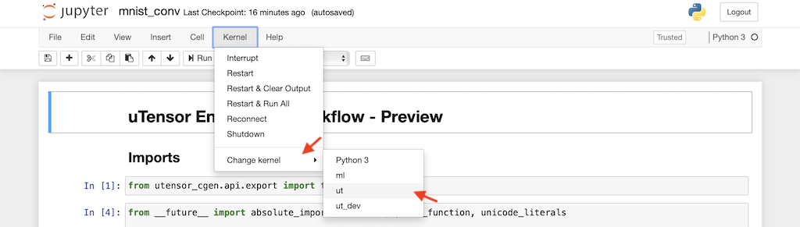

# TinyML via Code Generation

  uTensor uses a code-generation approach where C++ code is generated from a trained model. The generated code is easily integrated with embedded projects:


  
  uTensor is as small as 2kB. It supports multiple memory planning strategies and integrates well with optimized computational kernels, for example, CMSIS-NN from Arm. The uTensor C++ runtime interfaces are clear and designed specific for embedded ML. The uTensor Python SDK is designed for customizability from the ground up. Hardware and software designers can take advantage of the extensbility uTensor offers to prototype and deploy their solutions.

  We find the code-generation is a good balance weighting all the trade-offs above. 

  The rest of the tutorial presents the steps to set up your environment and deploy your first model with uTensor.

## Requirements
- Brew (for MacOS)
- Python
- uTensor-CLI
- Jupyter
- Git & Mercurial
- Mbed-CLI
- ST-Link *(optional, only for ST boards)*


## Environment Setup
This tutorial focus on the instructions for MacOS; however, other operating systems follow very similar steps.

### Install Brew
Brew is a user-space package manager for MacOS. In the terminal, enter:
```bash
$ /bin/bash -c "$(curl -fsSL https://raw.githubusercontent.com/Homebrew/install/master/install.sh)"
```
Other systems use different package managers, for example, `apt` on Ubuntu Linux.

### Install and Setup Python
We should never use the system's Python for our developments. Using a Python virtual environment for our TinyML development is a better practice. A dedicated Python environment to protects the system's Python and to keep our package dependencies manageable.
#### Install [`pyenv`](https://github.com/pyenv/pyenv)
  `pyenv` is a nice software that makes switching between versions of Python runtime frictionless. It is installed with:
  ```bash
  $ brew update
  $ brew install pyenv
  
  # Add it to your shell (ZSH in this case)
  # You may have to adapt the steps here for other shells
  $ echo 'export PYENV_ROOT="$HOME/.pyenv"' >> ~/.zshrc
  $ echo 'export PATH="$PYENV_ROOT/bin:$PATH"' >> ~/.zshrc
  $ echo 'if command -v pyenv 1>/dev/null 2>&1; then  eval "$(pyenv init -)"; fi' >> ~/.zshrc
  $ source ~/.zshrc
  ```
  View all Python versions avaliable to us:
  ```bash
  $ pyenv install --list
  ```
  Install `Python 3.6.8` and set it to our default Python:
  ```bash
  $ pyenv install 3.6.8
  $ pyenv global 3.6.8
  $ python --version
Python 3.6.8
  ```
  Create a Python Virtual Environment named `ut` for TinyML
  ```bash
  $ mkdir ~/.pyvenv
  $ python -m venv ~/.pyvenv/ut
  # Add it to shell
  $ echo 'alias ut="source ~/.pyvenv/ut/bin/activate"' >> ~/.zshrc
  $ source ~/.zshrc
  ```
Activating and de-activating a virtual environment:
  ```
  # Activate it
  $ ut
  (ut) $

  # to deactivate it:
  (ut) $ deactivate
  $
  ```
  Now, whenever you type `ut`, the virtual environment will be activated. To exit the virtual environment, type `deactivate`.
#### Install uTensor-CLI and Jupyter
The `ut` is a newly created virtual environment; uTensor-CLI and Jupyter-notebook need to be installed. Please note that explicit TensorFlow installation is not required here as it is included in uTensor-CLI's installation.

Ensure you are performing the installation in the virtual environment:
```bash
$ ut
(ut) $ pip install utensor_cgen jupyterlab
# link the current virtual environment with Jupyter
(ut) $ pip install ipykernel
(ut) $ ipython kernel install --user --name=ut
```
### Mbed-CLI Installation
Installing the dependencies for [Mbed-CLI](https://os.mbed.com/docs/mbed-os/v6.0/quick-start/build-with-mbed-cli.html) with Brew. You may skip them if they are already installed on your system (git, mercurial, and Arm cross-compiler).
```bash
 (ut) $ brew install git mercurial 
 (ut) $ brew tap ArmMbed/homebrew-formulae
 (ut) $ brew install arm-none-eabi-gcc
```
Install the Mbed-CLI with `pip`.
```bash
(ut) $ pip install mbed-cli
```

## The Sample Project
Clone the [hello-world sample project](https://github.com/uTensor/utensor-helloworld) using `git`:
```bash
(ut) $ git clone https://github.com/uTensor/utensor-helloworld
(ut) $ git cd utensor-helloworld
```
Here's the content of the repository:
```
.
├── Pipfile
├── Pipfile.lock
├── README.md
├── constants
│   └── my_model
│       └── params_my_model.hpp
├── input_image.h
├── main.cpp
├── mbed-os.lib
├── mbed_app.json
├── mnist_conv.ipynb
├── models
│   └── my_model
│       ├── my_model.cpp
│       └── my_model.hpp
└── uTensor.lib
```
The Jupyter-notebook, [mnist_conv.ipynb](https://github.com/uTensor/utensor-helloworld/blob/master/mnist_conv.ipynb), hosts the training code and uses the uTensor API, which generates C++ code from the trained model. For simplicity, the project already contains the generated C++ code in the `constant` and `models` folders, so they are ready to be compiled. These pre-generated code will be overwritten after you run the notebook in the next section.


## Model Creation
Here, we will only discuss the code specific to the model architecture and uTensor. The full notebook can be [viewed online](https://github.com/uTensor/utensor-helloworld/blob/master/mnist_conv.ipynb). The code is easily modifiable to suit your application.

The Jupyter-notebook is launched from the project root:
```bash
(ut) $ jupyter-notebook mnist_conv.ipynb &
```
Once the notebook is launched, set the kernel by choosing `Kernel` > `Change Kernel` > `ut`:



### Defining the Model
We defined a convulutional neural network with less than 5kB (after quantization) of parameters:
```python
class MyModel(Model):
  def __init__(self):
    super(MyModel, self).__init__()
    self.conv1 = Conv2D(8, 3, activation='relu')
    self.pool = MaxPooling2D()
    self.flatten = Flatten()
    self.d1 = Dense(16, activation='relu')
    self.d2 = Dense(10)

  def call(self, x):
    x0 = self.pool(x)
    x1 = self.conv1(x0)
    x2 = self.pool(x1)
    x3 = self.flatten(x2)
    x4 = self.d1(x3)
    return self.d2(x4)

model = MyModel()
```
The network above is a good starting point for 2D datasets, though, it often makes sense to remove the first pooling layer for many datasets:

```python
x0 = self.pool(x)
```
 As you tweak the model architecture, pay attention not only to the accuracy of the model, but also the model parameter size. For more details, please refer to the [model size estimation](#model-size-and-ram-estimation) section.


### Training
The above command should lanuch a browser window showing the notebook. Run the notebook by selecting `Kernel` > `Restart & Run All` from its dropdown menu:


The training will run-through 15 epochs. Scroll down the notebook and look for the **Training Loop** header; you should see similar output:
```
Epoch 1, Loss: 0.459749698638916, Accuracy: 86.40333557128906, Test Loss: 0.18603216111660004, Test Accuracy: 94.27000427246094
Epoch 2, Loss: 0.1707976907491684, Accuracy: 94.72833251953125, Test Loss: 0.13616280257701874, Test Accuracy: 95.6300048828125
                                .
                                .
                                .
Epoch 15, Loss: 0.06735269725322723, Accuracy: 97.87333679199219, Test Loss: 0.08755753189325333, Test Accuracy: 97.13999938964844
```
## Code Generation
uTensor has a one-liner export API. A few arguments are required for it to generate C++ code:

- `model`: a trained Keras model object
- `representive_dataset`: a generate that samples from input datasets. It is used to estimate the appropriate quantization parameters for a model. Please refer to the [quantization section](#offline-quantization).
- `model_name`: the export name of the model
- `target`: we use 'utensor' here, more targets will be added.
uTensor can generate C++ source code from a trained model with a one-liner:
```python
from utensor_cgen.api.export import tflm_keras_export

tflm_keras_export(
    model,
    representive_dataset=representative_dataset_gen,
    model_name='my_model',
    target='utensor',
)
```
The above function call will overwrite the files under the `constant` and `models` folder:
```
...
[INFO _code_generator.py _time_slot_generate_files @ 248] model parameters header file generated: constants/my_model/params_my_model.hpp
[INFO _code_generator.py _time_slot_generate_files @ 268] model header file generated: models/my_model/my_model.hpp
[INFO _code_generator.py _time_slot_generate_files @ 287] model cpp file generated: models/my_model/my_model.cpp
```
Please go ahead and explore the contents of these files. They will lend you more insights into how uTensor works.

## Device Code
In the previous section, we have trained a CNN on MNIST and exported it using uTensor. Here, we are showing how to invoke the model from [main.cpp](https://github.com/uTensor/utensor-helloworld/blob/master/main.cpp). We are feeding a hand-written digit of `7` contained in [input_image.h](https://github.com/uTensor/utensor-helloworld/blob/0165cfe51b3ae08de26d0bb189f53942414abfe3/input_image.h#L2) into the model, but you can change it to take data from other sources. A few steps are required to invoke an uTensor Model:
- [Initializing the Model](#initializing-the-model)
- [Creating Tensors](#creating-tensors)
- [Setting Up Data](#setting-up-data)
- [Running the Model](#running-the-model)

For the complete source code, please refer to the [main.cpp](https://github.com/uTensor/utensor-helloworld/blob/master/main.cpp).
### Initializing the Model
We first have to instantize the generated model:
```cpp
static My_model model;
```
The `My_model` class is generated from our trained model, and its name is set by the `model_name='my_model'` argument provided to the one-line export API.

The `My_model` class is responsible for:
- [Operator registration](https://github.com/uTensor/utensor-helloworld/blob/0165cfe51b3ae08de26d0bb189f53942414abfe3/models/my_model/my_model.hpp#L8-L35)
- [Initalizing memory allocators with pre-determined RAM usage](https://github.com/uTensor/utensor-helloworld/blob/0165cfe51b3ae08de26d0bb189f53942414abfe3/models/my_model/my_model.hpp#L33-L34)
- [Implementation of the model](https://github.com/uTensor/utensor-helloworld/blob/master/models/my_model/my_model.cpp)
### Creating Tensors
Input and output tensors need to be created to pass input data into the mode and store the model output. Shapes and data types need to be specified during tensor creations. For example:
```cpp
  Tensor input_image = new RomTensor({1, 28, 28, 1}, flt, arr_input_image);
```
The `input_image` tensor is our input tensor. The `flt` indicates it is of type `float` and has a `shape` of `{1, 28, 28, 1}`. It contains data pointed to by the `arr_input_image` pointer.

```cpp
Tensor logits = new RamTensor({1, 10}, flt);
```
The `logits` tensor is our output tensor. It is a floating point tensor of shape `{1, 10}`.

In this example, we use two types of tensors:
- `RomTensor`: a type of tensor class that represent data in the read-only region of the device, e.g. flash memory. It takes a pointer to read-only memory, `arr_input_image`, defined in the [input_image.h](https://github.com/uTensor/utensor-helloworld/blob/0165cfe51b3ae08de26d0bb189f53942414abfe3/input_image.h#L2).
- `RamTensor`: a tensor class that represents data in RAM.

For more details on tensors, please check out the [TensorInterface](https://github.com/uTensor/uTensor/blob/d0a285a9ef03c419b80ccf364bda31e225aec1a1/src/uTensor/core/tensorBase.hpp#L36-L57).

### Setting Up Data
The tensor values can be read and written by specifying the indexi and data type:
#### Read
```cpp
float pixel_value = static_cast<float>(input_image(0, 1, 1, 0));
```
#### Write
```cpp
input_image(0, 1, 1, 0) = static_cast<float>(1.234f);
```

### Running the Model
To run the model, we have to set the input and output tensors, and, call the `eval()` method:
```cpp
model.set_inputs({{My_model::input_0, input_image}})
    .set_outputs({{My_model::output_0, logits}})
    .eval();
```
The `set_inputs()` and `set_outputs()` methods bind the input and output tensors to the model respectively. The input and output names of the generated model can be viewed in its [header file](https://github.com/uTensor/utensor-helloworld/blob/0165cfe51b3ae08de26d0bb189f53942414abfe3/models/my_model/my_model.hpp#L11-L12). In this case, they are `input_0` and `output_0` as shown in the code snippet above.

After calling the `eval()` method on the model, the output tensor, `logits` contains the inference result. You may wish to check out the [argmax()](https://github.com/uTensor/utensor-helloworld/blob/0165cfe51b3ae08de26d0bb189f53942414abfe3/main.cpp#L13-L25) function for more example on how tensors are accessed.

## Deployment
Mbed-CLI is the primary tool used in this section. It is a fusion of a cross-compiler, package manager, flash programmer, and serial communicator.

The `.lib` files contain references to libraries on Github. Mbed-CLI uses these references to download the required source code when it deploys the project.

### Compile and Flash
Connect your Mbed enabled board to your computer, then:
```bash
(ut) $ mbed deploy
(ut) $ mbed compile -m auto -t GCC_ARM -f --sterm
```
A brief summary of the arguments provided to `mbed compile`:
- `-m auto`: auto detect the board connected, and set it as the current target.
- `-t GCC_ARM`: use GCC as our cross-compiler toolchain. In this case, it is `arm-none-eabi-gcc` we installed using `brew` in an earlier step.
- `-f`: flash it to the device when compilation is completed
- `--sterm`: connect the device's serial terminal
This is the output you should see:
```bash
Link: utensor-helloworld
Elf2Bin: utensor-helloworld
| Module           |      .text |    .data |      .bss |
|------------------|------------|----------|-----------|
| [fill]           |    485(+0) |   13(+0) |  2450(+0) |
| [lib]/c.a        |  68199(+0) | 2574(+0) |   127(+0) |
| [lib]/gcc.a      |   7196(+0) |    0(+0) |     0(+0) |
| [lib]/m.a        |    340(+0) |    0(+0) |     0(+0) |
| [lib]/misc       |    180(+0) |    4(+0) |    28(+0) |
| [lib]/nosys.a    |     32(+0) |    0(+0) |     0(+0) |
| [lib]/stdc++.a   | 191922(+0) |  145(+0) |  5720(+0) |
| main.o           |  14696(+0) |    0(+0) |  5969(+0) |
| mbed-os/drivers  |    206(+0) |    0(+0) |     0(+0) |
| mbed-os/hal      |   1777(+0) |    8(+0) |   131(+0) |
| mbed-os/platform |   7679(+0) |  260(+0) |   357(+0) |
| mbed-os/rtos     |   7979(+0) |  168(+0) |  5972(+0) |
| mbed-os/targets  |   9221(+0) |   36(+0) |   386(+0) |
| models/my_model  |   8448(+0) |    0(+0) |     0(+0) |
| uTensor/src      |   6031(+0) |    0(+0) |    36(+0) |
| Subtotals        | 324391(+0) | 3208(+0) | 21176(+0) |
Total Static RAM memory (data + bss): 24384(+0) bytes
Total Flash memory (text + data): 327599(+0) bytes

Image: ./BUILD/K64F/GCC_ARM/utensor-helloworld.bin
--- Terminal on /dev/tty.usbmodem14102 - 9600,8,N,1 ---
Simple MNIST end-to-end uTensor cli example (device)
pred label: 7
```
Our input data in [input_image.h](https://github.com/uTensor/utensor-helloworld/blob/0165cfe51b3ae08de26d0bb189f53942414abfe3/input_image.h#L2) actually contains an hand-written digit `7`. Thus, we see the output above shows `pred label: 7`.

Press `ctrl + c` to disconnect the serial terminal.

Notice code size of uTensor:
```bash
| uTensor/src      |   6031(+0) |    0(+0) |    36(+0) |
```
The uTensor core and all the operators required to run a convolutional neural network contribute to less than **6kB** in terms of binary size.
 
## Offline Quantization
Offline-quantization is a powerful way to reduce the memory requirement while running models on MCUs. It works by mapping 32-bit floating-point number to 8-bit fix-point representation, reducing the memory footprint by about 4x.

Quantization is often applied in a per-tensor-dimension basis, and it requires us to know the full range of the dimension. A typical evaluation of a neural network layer consists of model parameters, inputs, and activations. Estimating the ranges of model parameters is straight forward because they are typically constants.

The activation range, on the other hand, varies with the input values. For offline-quantization to work, we have to feed some sample input data to the quantization routine so that it can record the activation ranges. These recorded activation ranges are then embedded into the generated code. The kernels accept these values and quantize the activation at the runtime.

The following Python generator from [mnist_conv.ipynb](https://github.com/uTensor/utensor-helloworld/blob/master/mnist_conv.ipynb) provides randomly sampled inputs to the quantization routine:
```python
# representative data function
num_calibration_steps = 128
calibration_dtype = tf.float32

def representative_dataset_gen():
    for _ in range(num_calibration_steps):
        rand_idx = np.random.randint(0, x_test.shape[0]-1)
        sample = x_test[rand_idx]
        sample = sample[tf.newaxis, ...]
        sample = tf.cast(sample, dtype=calibration_dtype)
        yield [sample]
```

## Model Size and RAM Estimation
Oftentimes, a model's size and RAM usage can be estimated from the model architecture itself. Here's a helper function that prints the model parameters given the input shape:
```python
def print_model_summary(model, input_shape):
  input_shape_nobatch = input_shape[1:]
  model.build(input_shape)
  inputs = tf.keras.Input(shape=input_shape_nobatch)
  
  if not hasattr(model, 'call'):
      raise AttributeError("User should define 'call' method in sub-class model!")
  
  _ = model.call(inputs)
  model.summary()

#providing the model and its input shape
print_model_summary(model, x_test.shape)
```
Output:
```
Model: "my_model"
_________________________________________________________________
Layer (type)                 Output Shape              Param #   
=================================================================
conv2d (Conv2D)              (None, 12, 12, 8)         80        
_________________________________________________________________
max_pooling2d (MaxPooling2D) multiple                  0         
_________________________________________________________________
flatten (Flatten)            (None, 288)               0         
_________________________________________________________________
dense (Dense)                (None, 16)                4624      
_________________________________________________________________
dense_1 (Dense)              (None, 10)                170       
=================================================================
Total params: 4,874
Trainable params: 4,874
Non-trainable params: 0
```
The total number of parameters is around 4,874. Because model parameters are typically constants for inferencing's consideration, they are stored in the ROM of your device.

Activations, on the other hand, may change through every inference cycle; thus, they are placed in RAM. For sequential model, a simple metric to estimate the RAM usage is by looking the combined size of the input and output of a layer at a given time.

## Conclusion
Congratulation on completing this example. This tutorial covers quite a bit of information and is quite advanced. Stay tuned for more writings on TinyML to come. We will be bringing you content on not only the deployment of embedded ML models but also how to extend uTensor to do exactly what you want, such as node-fusion, adding operators, custom memory plans, data collection, etc.

Also, there are many ways you can help the project, for example:
#### Star the Projects
[Starring the project](https://github.com/uTensor/uTensor) is a great way to recognize our work and support the community. Please help us to spread the words!
#### Join us on Slack
Our [Slack workspace](https://join.slack.com/t/utensor/shared_invite/zt-6vf9jocy-lzk5Aw11Z8M9GPf_KS5I~Q) is full of discussions on the latest ideas and development in uTensor. If you have questions, ideas, or want to get involved in the project, Slack is a great place to start.